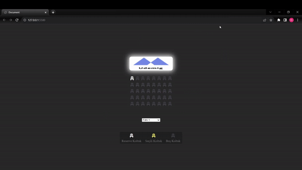

<h1>CINEMA RESERVATION SITE</h1>

This project represents an interactive cinema booking site developed using JavaScript. It offers users different movies, sessions and seat options, so users can choose the movie and session they want, identify suitable seats and make reservations.

<h2>Features</h2>

<ul>
        <li>Created using Html, Css and Javascript</li>
        <li>Full responsive</li>
        <li>User preferences, reservation details, and selected seats are stored in local storage.</li>
        <li>User interactions (e.g. clicks, mouse movements) are handled with JavaScript event handlers.</li>
        <li>Different animations are used</li>
</ul>

<h2>Screen Gif</h2>

